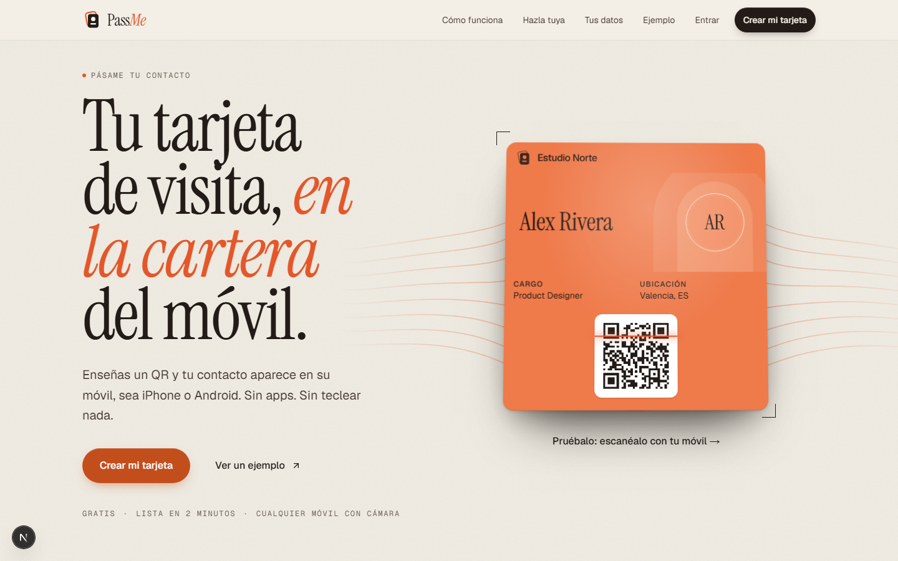
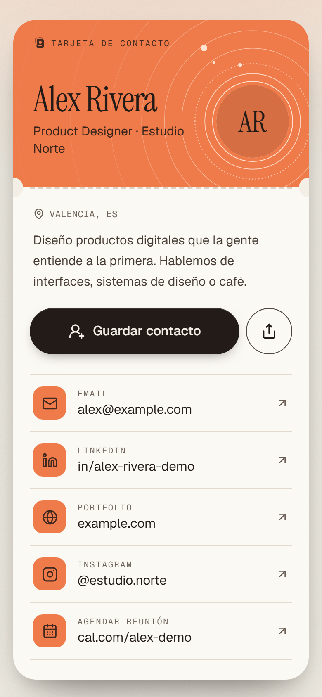
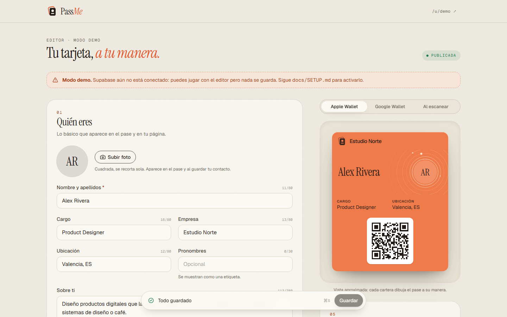

# PassMe

**Tu tarjeta de visita, en la cartera del móvil.** PassMe crea un pase de
**Apple Wallet** y **Google Wallet** con tu tarjeta de contacto. Doble clic al
botón lateral, enseñas el QR y la otra persona ve tu página con los contactos
que tú hayas decidido compartir — y los guarda en su agenda con un toque.

No es una app que haya que instalar ni una web que haya que recordar: vive en la
cartera, junto a tus tarjetas y billetes.

<p align="center">
  <br/>
  
  
</p>

## Qué hace

- **Pases de cartera**: `.pkpass` firmado para Apple Wallet y pase genérico de Google Wallet, con tu foto, nombre, cargo, empresa y un QR.
- **Un pase que no se parece a ningún otro**: eliges tema, motivo generativo (arco, corriente, persiana, tu monograma…), su variación y la letra de tu nombre; el editor te enseña tu propia tarjeta en cada opción. El arte se renderiza en el servidor y la vista previa es idéntica al pase real.
- **Página al escanear** (`/u/tu-nombre`): tarjeta con tus contactos, botón **Guardar contacto** (vCard con foto) y compartir.
- **Te dejo mi contacto** (opcional): quien escanea tu QR puede dejarte su nombre, email o teléfono. Lo ves en el editor, lo exportas a CSV o a Contactos, y te avisamos por email.
- **Crea la tuya** (`/crear`): quien escanea una tarjeta puede hacerse la suya en un minuto, viendo su pase mientras escribe; el email se pide al final y al terminar tiene su QR listo para enseñarlo.
- **Enlaces que no se rompen**: si cambias tu enlace, el antiguo sigue llevando a tu tarjeta y nadie puede quedárselo.
- **Privacidad por diseño**: cada contacto se puede ocultar; lo oculto **no sale del servidor** (lo filtra la base de datos). Métricas sin IPs ni cookies.
- **Siempre actualizada**: al editar tu tarjeta, los pases de Apple se actualizan solos (web service + push APNs) y el de Google se sincroniza por API.
- **Del ordenador al móvil**: el editor genera un QR temporal para añadir el pase en tu teléfono sin iniciar sesión allí.
- **Login sin contraseñas**: código de 8 cifras que se escribe en la misma pantalla (o el botón del email, y Google opcional), con bloqueo anti fuerza bruta y CAPTCHA opcional.
- **Métricas**: visitas, escaneos del QR, contactos guardados, pases añadidos y clics por enlace.
- **Modo demo**: sin configurar nada, todo funciona en local con una tarjeta de ejemplo.

Contactos soportados: email, teléfono, WhatsApp, LinkedIn, web, Instagram, X, GitHub, TikTok, YouTube, Telegram, agenda (Calendly/Cal.com) y enlaces personalizados.

## Empezar

```bash
npm install
npm run dev          # http://localhost:3000 — modo demo sin variables
```

- Tarjeta de ejemplo: <http://localhost:3000/u/demo>
- Crear una tarjeta (demo, el código es `00000000`): <http://localhost:3000/crear>
- Editor (demo): <http://localhost:3000/dashboard>

Para conectarlo de verdad (Supabase, Vercel, Apple, Google) sigue **[docs/SETUP.md](docs/SETUP.md)**. Después comprueba la configuración con:

```bash
npm run doctor
```

## Scripts

| Comando | Qué hace |
| --- | --- |
| `npm run dev` | Servidor de desarrollo (Turbopack) |
| `npm run build` / `npm start` | Build y servidor de producción |
| `npm test` | Tests unitarios + tests de la base de datos (migración real sobre PGlite) |
| `npm run e2e:demo` | Build en modo demo + Playwright (escritorio + móvil), aunque tengas `.env.local` |
| `npm run e2e` | Playwright contra el build ya hecho (lo que usa el CI) |
| `npm run lint` / `npm run typecheck` | ESLint / TypeScript |
| `npm run doctor` | Verifica variables y credenciales contra los servicios reales |
| `npm run brand` | Regenera favicon, icono iOS y logo de Google Wallet |
| `bash scripts/apple-certs.sh` | Prepara los certificados de Apple Wallet |

## Stack

Next.js 16 (App Router, `proxy.ts`) · React 19 · TypeScript · Tailwind CSS 4 ·
Supabase (Auth, Postgres con RLS, Storage) · Vercel · `passkit-generator` ·
`jose` · `sharp` · Zod · Vitest · Playwright.

Arquitectura, modelo de datos y decisiones: **[docs/ARCHITECTURE.md](docs/ARCHITECTURE.md)**.

## Estructura

```
src/
  app/                 rutas (landing, /u/[slug], /crear, /dashboard, /login, /wallet, api/*)
  components/          brand · card (pase, tarjeta, QR) · editor · landing · ui
  lib/
    card/              dominio: tipos de enlace, validación, vCard, colores, diseño y motivos, slugs
    data/              acceso a datos (Supabase)
    pass/              Apple (.pkpass, APNs, web service), Google Wallet y arte del pase (Satori)
    supabase/          clientes server/browser/admin y tipos
  proxy.ts             CSP con nonce, refresco de sesión y protección de /dashboard
supabase/              migraciones SQL y plantilla de email
scripts/               doctor, certificados Apple, assets de marca
tests/ · e2e/          Vitest · Playwright
```
