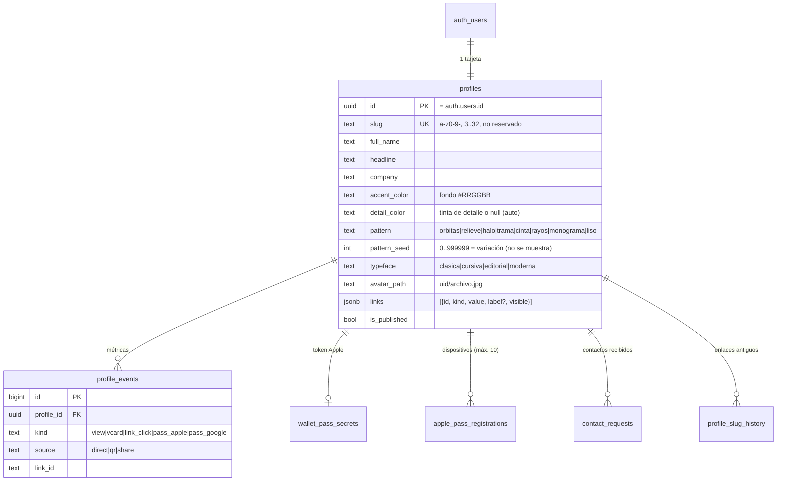
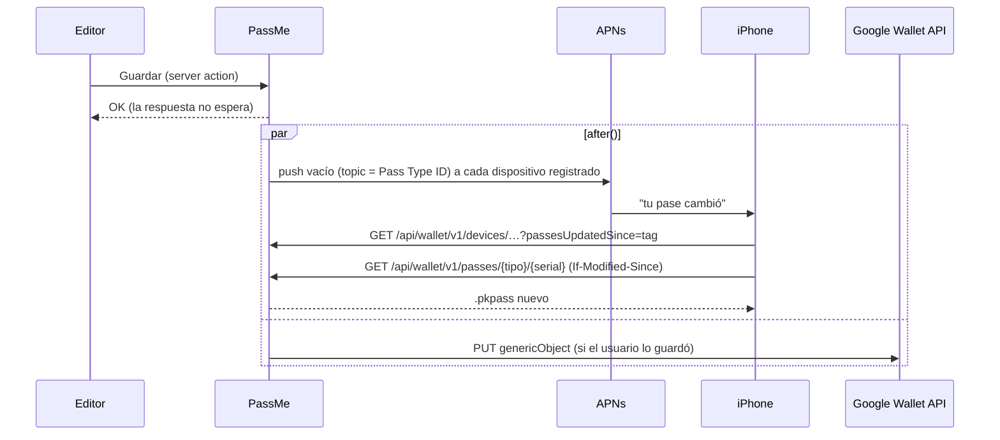
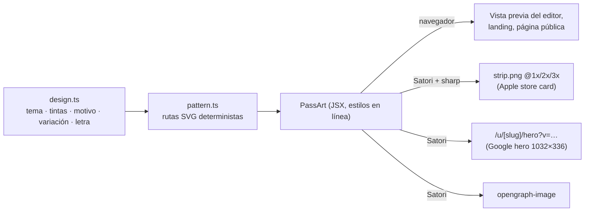

# Arquitectura de PassMe

## Flujo principal

```mermaid
sequenceDiagram
    actor Dueño
    actor Contacto as Otra persona
    participant Web as PassMe (Vercel)
    participant DB as Supabase
    participant Wallet as Apple / Google Wallet

    Dueño->>Web: Edita su tarjeta en /dashboard
    Web->>DB: saveCardAction (RLS: solo su fila)
    Dueño->>Web: "Añadir a Apple/Google Wallet"
    Web->>Wallet: .pkpass firmado / JWT "save to wallet"
    Note over Dueño,Wallet: Días después, en un evento…
    Dueño->>Contacto: Doble clic al botón lateral → QR
    Contacto->>Web: Escanea → /u/slug?src=qr
    Web->>DB: get_public_card(slug) — solo enlaces visibles
    Web-->>Contacto: Tarjeta + "Guardar contacto" (vCard)
    Contacto->>Web: "Te dejo mi contacto" (opcional)
    Web->>DB: submit_contact_request → lo ve solo el dueño
    Contacto->>Web: "Crea la tuya" → /crear?de=slug
    Note over Contacto,Web: Rellena lo básico viendo su pase; al final email + código
    Web->>DB: verifyOtp + createCardFromDraft (misma petición)
    Web-->>Contacto: /dashboard?nueva=1 → su QR para enseñárselo al dueño
```

### Alta y acceso

- **La tarjeta primero, el email al final** (`/crear`): el borrador vive en el navegador (`localStorage`, 1 h) mientras la persona se identifica. Con el código de 8 cifras, la tarjeta se crea en la misma petición que lo comprueba (`authAction` → `createQuickCard`). Si entra por el botón del email o con Google (quizá en otra pestaña), vuelve a `/crear` con sesión y la tarjeta se crea sola a partir del borrador guardado. Nunca se sobrescribe una tarjeta que ya tiene nombre.
- **El código es el camino principal** del email (iOS lo sugiere sobre el teclado; en Android se lee en la notificación) y el botón, la alternativa. La pestaña que espera el código detecta si el navegador ya inició sesión por el botón (al volver a ella o por `BroadcastChannel`) y continúa.
- **El botón del email no inicia sesión al abrirse**: `/auth/confirm` lleva a `/auth/entrar`, que pide un toque y verifica por POST. Los antivirus de correo (p. ej. Microsoft Defender) abren todos los enlaces, y el botón y el código comparten el mismo token: sin ese toque lo gastarían antes que la persona.
- La tarjeta creada sin intervención (al volver de Google o del botón) solo se crea si la sesión es de la misma cuenta a la que se envió el código; si no, el formulario espera un toque.
- Un usuario con sesión pero sin tarjeta que entra en `/dashboard` va a `/crear`. Los perfiles se crean ahí, de forma perezosa (no hay trigger de `auth.users`), así que un fallo en ellos nunca bloquea el alta.
- **Modo demo**: no se envía ningún email y el código es `00000000`, para poder probar el flujo completo (E2E incluidos).

## Módulos

| Capa | Dónde | Responsabilidad |
| --- | --- | --- |
| Dominio | `src/lib/card/*` | Tipos de enlace (validación + href seguro), esquema Zod, vCard 3.0, colores legibles, diseño (`design.ts`: temas, tintas, letra, variación) y motivos generativos (`pattern.ts`), slugs. Isomórfico: la misma validación en navegador y servidor. |
| Datos | `src/lib/data/*` | Lecturas/escrituras en Supabase. Cliente con sesión (RLS) para el dueño, cliente anónimo para lo público y cliente *admin* solo donde es imprescindible. `rate-limits.ts` (límites compartidos en Postgres), `contact-requests.ts` (contactos recibidos). |
| Pases | `src/lib/pass/*` | `apple.ts` (pass.json + firma), `google.ts` (objeto genérico + JWT + sync REST), `apns.ts` (push HTTP/2), `web-service.ts` (protocolo de Apple), `handoff.ts` (tokens de 30 min), `images.ts` (logo/icono con sharp), `art.tsx` (banda de Apple y *hero* de Google con Satori). |
| Rutas | `src/app/**` | Páginas (landing, tarjeta, alta `/crear`, login, editor, handoff, legales) y API (`/api/pass/*`, `/api/wallet/v1/*`, `/api/events`, `/api/health`, `/api/cron/cleanup`). Exportación de contactos en `/dashboard/contactos`. |
| Borde | `src/proxy.ts` | CSP con nonce por petición, refresco de sesión de Supabase, redirección de `/dashboard` sin sesión. |

## Modelo de datos



Además: `auth_otp_attempts` (HMAC de los emails que intentan un código, para bloquear fuerza bruta), `rate_limit_buckets` (contadores de límites por hash, tabla *unlogged*) y el bucket público `avatars`.

**Enlaces antiguos.** Al cambiar el slug, un *trigger* guarda el anterior en `profile_slug_history`: redirige a la tarjeta actual (los QR impresos siguen valiendo) y nadie más puede reclamarlo. Si se borra la cuenta, sus enlaces quedan en cuarentena 90 días. Máximo 10 enlaces antiguos por tarjeta.

**¿Por qué los enlaces son JSONB?** Guardar la tarjeta es una única operación atómica, el orden va implícito y la lectura pública es una fila. La validación estricta vive en la app (`schema.ts`) y la base de datos pone límites de forma (array, ≤ 20).

## Modelo de seguridad

- **RLS en todas las tablas.** El dueño solo ve y edita su fila. Los visitantes anónimos no tocan tablas: llaman a `get_public_card()` (`SECURITY DEFINER`, `search_path=''`), que devuelve la tarjeta publicada **sin** los enlaces ocultos. Lo oculto nunca llega al navegador.
- **Tablas solo-servidor** (`wallet_pass_secrets`, `apple_pass_registrations`, `auth_otp_attempts`): RLS activado sin políticas; solo la clave secreta puede leerlas.
- **Enlaces seguros**: cada tipo normaliza la entrada y construye el `href` (solo `https:`, `mailto:`, `tel:`); `javascript:`/`data:` imposibles. Los `attributedValue` del pase de Apple se escapan.
- **Avatares**: ruta validada en cliente, servidor y `CHECK` de Postgres; políticas de Storage limitadas a la carpeta del usuario; sin listado público.
- **Pases**: se descargan con sesión o con un token HS256 de 30 min firmado con `PASSME_SIGNING_SECRET` (flujo "enviar a mi móvil"). El web service de Apple exige el token por pase (`ApplePass …`, comparación en tiempo constante).
- **Login**: límites por IP, **bloqueo del código persistido** en dos capas: 5 intentos por email y dispositivo (IP) y 30 por email en total cada 15 min, así nadie puede bloquear a otra persona con cuatro códigos falsos (el intento se registra *antes* de comprobar el código, así que no hay carrera) y CAPTCHA opcional (Turnstile). La API de verificación de Supabase también es pública: por eso el código es de 8 dígitos y caduca en 10 min (docs/SETUP.md). Redirecciones `next` limitadas a rutas relativas.
- **Límites de peticiones** compartidos por todas las instancias (`rate_limit_hit` en Postgres, claves con hash) con respaldo en memoria si la base de datos no responde.
- **Contactos recibidos**: formulario público con *honeypot*, límites por IP y por tarjeta y CAPTCHA opcional; se inserta con `submit_contact_request` (solo el servidor) y RLS limita la lectura y el borrado al dueño. Exportación CSV con fórmulas neutralizadas.
- **Cabeceras**: CSP con nonce + `strict-dynamic` (todas las páginas se renderizan por petición para poder llevar nonce), HSTS, `X-Frame-Options: DENY`, `Referrer-Policy`, `Permissions-Policy`.
- **Privacidad**: métricas sin IPs ni cookies (una visita por sesión del navegador); los clics solo cuentan si el enlace existe y es visible; los bots/previsualizadores no cuentan; las tarjetas llevan `noindex`. Retención: `cleanup_expired_data()` a diario (Vercel Cron).

## Actualización de pases



El número de serie del pase es el `id` del perfil; el `lastUpdated` es el `updated_at` en milisegundos.

## Arte del pase



Las imágenes se memorizan por versión del arte (colores, motivo, semilla, letra, nombre y foto). La guía visual completa está en [`BRAND.md`](BRAND.md).

## Decisiones

| Decisión | Motivo |
| --- | --- |
| Next.js en Vercel + Supabase | Lo pedido; cero servidores que mantener, plan gratuito suficiente para el MVP. |
| Perfiles creados en la app (no trigger en `auth.users`) | Un fallo al generar el slug nunca puede bloquear un registro. |
| Pase *store card* de Apple | Es el único estilo con banda de imagen a todo el ancho (375×144 pt): ahí va el arte de la tarjeta (motivo, foto y nombre en la letra elegida). Los campos de texto reales (cargo, ubicación) siguen debajo para VoiceOver y el Apple Watch. |
| Un solo componente de arte (`components/card/pass-art.tsx`) | Estilos en línea y flexbox: el mismo árbol lo pinta el navegador (vista previa) y Satori en el servidor (PNG del pase). Lo que ves en el editor es lo que llega a la cartera. |
| Motivo con semilla guardada | La semilla (`pattern_seed`) genera el motivo de forma determinista; editar el nombre no cambia el dibujo, «Otra variación» sí. El número nunca se enseña: se elige a ojo. |
| Motivos retirados en lectura, no en validación | Los valores antiguos (`sello`, `senal`, `ondas`) se traducen al leer (`toPatternKind`) y el `CHECK` los sigue aceptando durante el despliegue; los clientes nuevos solo pueden enviar motivos actuales. |
| QR sin `altText` en Apple | Wallet imprime ese texto bajo el código y agranda la placa blanca; el enlace ya está en el reverso del pase. |
| *Hero* de Google con `?v=` | Google cachea las imágenes por URL; la versión (hash de las entradas del arte) cambia solo cuando cambia el dibujo. |
| JWT con clase + objeto para Google | No hace falta llamar a la API para crear el pase; la API solo se usa para actualizar. |
| vCard 3.0 | La versión con mejor compatibilidad en iOS y Android. |
| Modo demo sin variables | Se puede enseñar y desarrollar sin credenciales; los tests E2E corren sin secretos. |
| Rate limit en Postgres | Sin otro proveedor que mantener: una llamada `rate_limit_hit` por petición limitada, compartida entre instancias. Si falla, cae a memoria. |
| Contactos recibidos opt-in | Privacidad por defecto: el dueño decide si su página muestra el formulario; el visitante da su consentimiento explícito. |

## Ideas para después del MVP

- **Varias tarjetas por persona** (trabajo / personal) con contactos distintos.
- **Plan empresas**: una compañía da de alta a su equipo con su marca, colores y logo en el pase. Es el camino natural de monetización.
- **Modo evento**: fecha y lugar relevantes en el pase para que aparezca en la pantalla de bloqueo durante una feria.
- **NFC** en Apple Wallet (requiere solicitar el entitlement a Apple).
- **Sentry** (o similar) para errores en producción.
- **Inglés** y demás idiomas (los textos están centralizados por componente).
