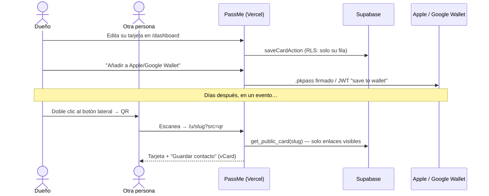
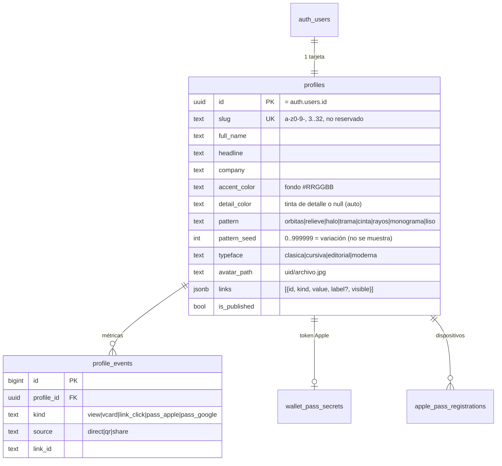
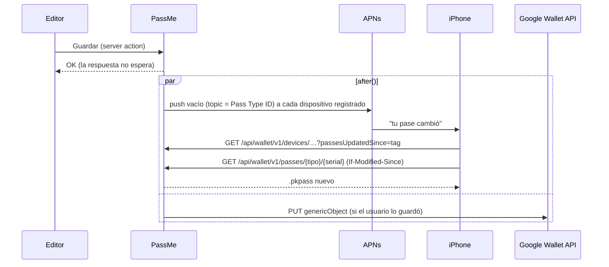
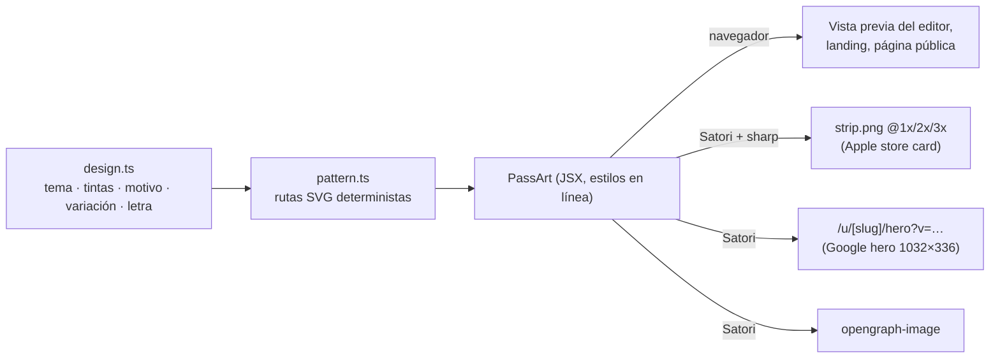

# Arquitectura de PassMe

## Flujo principal

## Módulos

| Capa | Dónde | Responsabilidad |
| --- | --- | --- |
| Dominio | `src/lib/card/*` | Tipos de enlace (validación + href seguro), esquema Zod, vCard 3.0, colores legibles, diseño (`design.ts`: temas, tintas, letra, variación) y motivos generativos (`pattern.ts`), slugs. Isomórfico: la misma validación en navegador y servidor. |
| Datos | `src/lib/data/*` | Lecturas/escrituras en Supabase. Cliente con sesión (RLS) para el dueño, cliente anónimo para lo público y cliente *admin* solo donde es imprescindible. |
| Pases | `src/lib/pass/*` | `apple.ts` (pass.json + firma), `google.ts` (objeto genérico + JWT + sync REST), `apns.ts` (push HTTP/2), `web-service.ts` (protocolo de Apple), `handoff.ts` (tokens de 30 min), `images.ts` (logo/icono con sharp), `art.tsx` (banda de Apple y *hero* de Google con Satori). |
| Rutas | `src/app/**` | Páginas (landing, tarjeta, login, editor, handoff) y API (`/api/pass/*`, `/api/wallet/v1/*`, `/api/events`, `/api/health`). |
| Borde | `src/proxy.ts` | CSP con nonce por petición, refresco de sesión de Supabase, redirección de `/dashboard` sin sesión. |

## Modelo de datos

Además: `auth_otp_attempts` (hashes SHA-256 de emails con códigos fallidos, para bloquear fuerza bruta) y el bucket público `avatars`.

**¿Por qué los enlaces son JSONB?** Guardar la tarjeta es una única operación atómica, el orden va implícito y la lectura pública es una fila. La validación estricta vive en la app (`schema.ts`) y la base de datos pone límites de forma (array, ≤ 20).

## Modelo de seguridad

- **RLS en todas las tablas.** El dueño solo ve y edita su fila. Los visitantes anónimos no tocan tablas: llaman a `get_public_card()` (`SECURITY DEFINER`, `search_path=''`), que devuelve la tarjeta publicada **sin** los enlaces ocultos. Lo oculto nunca llega al navegador.
- **Tablas solo-servidor** (`wallet_pass_secrets`, `apple_pass_registrations`, `auth_otp_attempts`): RLS activado sin políticas; solo la clave secreta puede leerlas.
- **Enlaces seguros**: cada tipo normaliza la entrada y construye el `href` (solo `https:`, `mailto:`, `tel:`); `javascript:`/`data:` imposibles. Los `attributedValue` del pase de Apple se escapan.
- **Avatares**: ruta validada en cliente, servidor y `CHECK` de Postgres; políticas de Storage limitadas a la carpeta del usuario; sin listado público.
- **Pases**: se descargan con sesión o con un token HS256 de 30 min firmado con `PASSME_SIGNING_SECRET` (flujo "enviar a mi móvil"). El web service de Apple exige el token por pase (`ApplePass …`, comparación en tiempo constante).
- **Login**: OTP con límite por IP y **bloqueo por email persistido** (5 fallos / 15 min). Redirecciones `next` limitadas a rutas relativas.
- **Cabeceras**: CSP con nonce + `strict-dynamic` (todas las páginas se renderizan por petición para poder llevar nonce), HSTS, `X-Frame-Options: DENY`, `Referrer-Policy`, `Permissions-Policy`.
- **Privacidad**: métricas sin IPs ni cookies; los bots/previsualizadores no cuentan; las tarjetas llevan `noindex`.

## Actualización de pases

El número de serie del pase es el `id` del perfil; el `lastUpdated` es el `updated_at` en milisegundos.

## Arte del pase

Las imágenes se memorizan por versión del arte (colores, motivo, semilla, letra, nombre y foto). La guía visual completa está en [`BRAND.md`](BRAND.md).

## Decisiones

| Decisión | Motivo |
| --- | --- |
| Next.js en Vercel + Supabase | Lo pedido; cero servidores que mantener, plan gratuito suficiente para el MVP. |
| Perfiles creados en la app (no trigger en `auth.users`) | Un fallo al generar el slug nunca puede bloquear un registro. |
| Pase *store card* de Apple | Es el único estilo con banda de imagen a todo el ancho (375×144 pt): ahí va el arte de la tarjeta (motivo, foto y nombre en la letra elegida). Los campos de texto reales (cargo, ubicación) siguen debajo para VoiceOver y el Apple Watch. |
| Un solo componente de arte (`components/card/pass-art.tsx`) | Estilos en línea y flexbox: el mismo árbol lo pinta el navegador (vista previa) y Satori en el servidor (PNG del pase). Lo que ves en el editor es lo que llega a la cartera. |
| Motivo con semilla guardada | La semilla (`pattern_seed`) genera el motivo de forma determinista; editar el nombre no cambia el dibujo, «Otra variación» sí. El número nunca se enseña: se elige a ojo. |
| Motivos retirados en lectura, no en validación | Los valores antiguos (`sello`, `senal`, `ondas`) se traducen al leer (`toPatternKind`) y el `CHECK` los sigue aceptando durante el despliegue; los clientes nuevos solo pueden enviar motivos actuales. |
| QR sin `altText` en Apple | Wallet imprime ese texto bajo el código y agranda la placa blanca; el enlace ya está en el reverso del pase. |
| *Hero* de Google con `?v=` | Google cachea las imágenes por URL; la versión (hash de las entradas del arte) cambia solo cuando cambia el dibujo. |
| JWT con clase + objeto para Google | No hace falta llamar a la API para crear el pase; la API solo se usa para actualizar. |
| vCard 3.0 | La versión con mejor compatibilidad en iOS y Android. |
| Modo demo sin variables | Se puede enseñar y desarrollar sin credenciales; los tests E2E corren sin secretos. |
| Rate limit en memoria | Suficiente para el MVP; donde importa de verdad (OTP) hay bloqueo persistido en Supabase. |

## Ideas para después del MVP

- **Varias tarjetas por persona** (trabajo / personal) con contactos distintos.
- **Plan empresas**: una compañía da de alta a su equipo con su marca, colores y logo en el pase. Es el camino natural de monetización.
- **Intercambio de contacto**: formulario opcional en la tarjeta para que la otra persona te deje el suyo (leads).
- **NFC** en Apple Wallet (requiere solicitar el entitlement a Apple).
- **Historial de slugs** con redirecciones para que cambiar el enlace no rompa los QR antiguos.
- **Rate limiting distribuido** (Upstash) y **Sentry** para errores.
- **Inglés** y demás idiomas (los textos están centralizados por componente).
